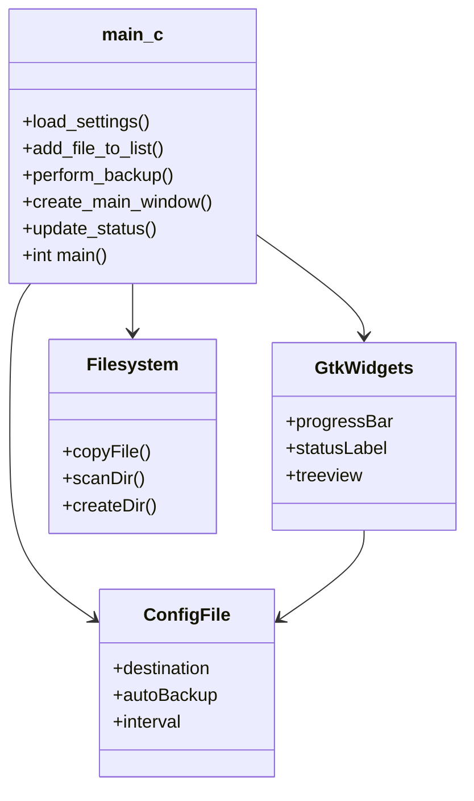
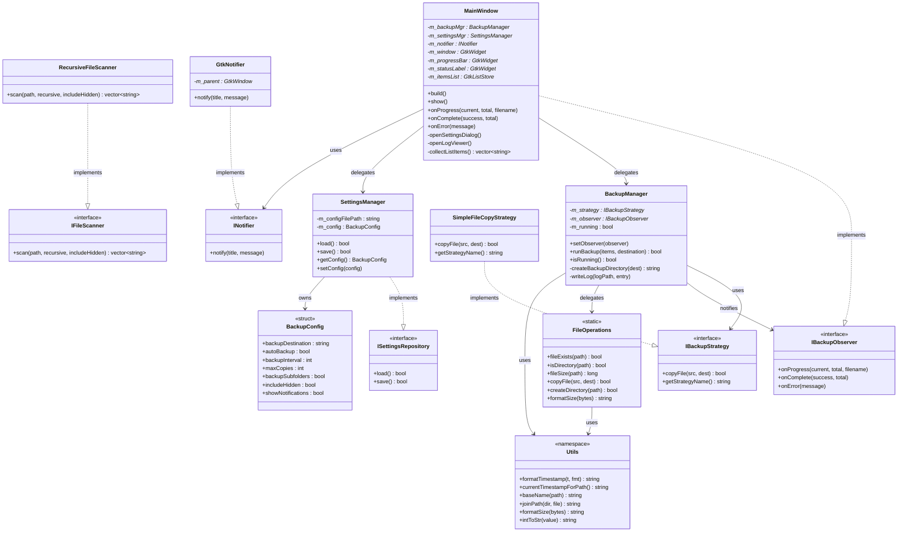
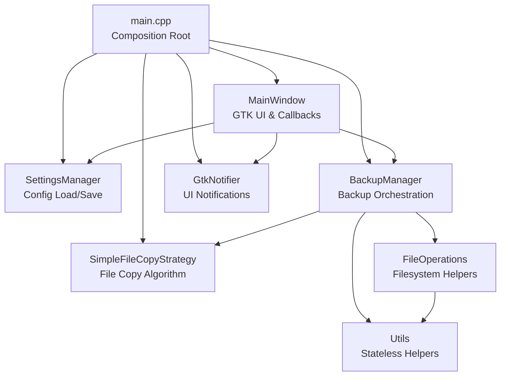

# 🗂️ Smart Backup Utility — SOLID Refactoring Guide

**Course:** Advanced Programming Lab | **Project:** Smart Backup Utility (C++) | **Date:** March 2026

---

## 1. Project Overview

Smart Backup Utility is a GTK3-based desktop application for Windows that allows users to select files/folders for backup, queue and copy them to a destination, schedule automatic backups, and view per-session logs with success/failure tracking.

**Refactoring Philosophy:** *"Apply SOLID principles incrementally without breaking existing functionality."*

---

## 2. v1.0 → v2.0: What Changed

| | v1.0 (Before) | v2.0 (After) |
|---|---|---|
| Language | C | C++17 |
| Design | Procedural (`main.c`) | OOD with SOLID principles |
| Files | 1 file (`main.c`) | 6 source + 5 header files |
| Lines per file | ~700 lines | 20–350 lines each |
| Known bugs | 3 | 0 |
| String safety | `sprintf`, `strcpy` | `std::string`, `std::ofstream` |
| Failure logging | Silent skip | Logged as `[ERR]` |
| Dependency management | Global variables | Constructor injection (DIP) |
| Extensibility | Modify existing code | Add new classes (OCP) |
| `.gitignore` | ❌ | ✅ |

---

## 3. Folder Structure

### Before

```
smart-backup-utility/
└── main.c    ← Everything in one file (~700 lines)
```

### After

```
smart-backup-utility/
│
├── backup.h / backup.cpp         ← IBackupStrategy, IBackupObserver, BackupManager
├── fileops.h / fileops.cpp       ← IFileScanner, FileOperations, RecursiveFileScanner
├── settings.h / settings.cpp     ← ISettingsRepository, BackupConfig, SettingsManager
├── utils.h / utils.cpp           ← Utils namespace (stateless helpers)
├── window.h / window.cpp         ← INotifier, GtkNotifier, MainWindow
├── main.cpp                      ← Entry point + DI wiring (composition root)
└── Makefile
```

Each file has **one clear responsibility**. The only place concrete objects are created is `main.cpp`.

---

## 4. UML Diagrams

### Before Refactoring — Monolithic Structure



### After Refactoring — SOLID Class Structure



### Module Dependency Flow



---

## 5. SOLID Principles Applied

### S — Single Responsibility

Each class has exactly one reason to change:

| Class | Single Responsibility |
|---|---|
| `BackupManager` | Orchestrates backup flow only — no GTK, no config, no filesystem |
| `SettingsManager` | Reads/writes `BackupConfig` to disk only — no timers, no GTK |
| `FileOperations` | Filesystem queries and copies only — no business logic |
| `MainWindow` | Manages GTK UI and relays callbacks only |
| `Utils` | Pure stateless helper functions only — no side effects |
| `BackupConfig` | Holds config values only — zero logic |

```cpp
// SRP in action — SettingsManager has one reason to change:
// only if the config file format changes.
bool SettingsManager::load() {
    std::ifstream file(m_configFilePath);
    // reads key=value pairs into BackupConfig
    // does NOT start timers, create backup dirs, or touch GTK
}
```

### O — Open/Closed

`BackupManager` is open for extension but closed for modification:

```cpp
// IBackupStrategy — backup.h
class IBackupStrategy {
public:
    virtual bool copyFile(const std::string& src, const std::string& dest) = 0;
    virtual std::string getStrategyName() const = 0;
    virtual ~IBackupStrategy() = default;
};

// Concrete strategy — main.cpp (swap without touching BackupManager)
class SimpleFileCopyStrategy : public IBackupStrategy {
    bool copyFile(const std::string& src, const std::string& dest) override {
        return FileOperations::copyFile(src, dest);
    }
    std::string getStrategyName() const override { return "SimpleCopy"; }
};
```

| Future strategy | New class | `BackupManager` changed? |
|---|---|---|
| Zip compression | `ZipBackupStrategy` | ❌ No |
| Cloud upload | `CloudBackupStrategy` | ❌ No |
| Encrypted copy | `EncryptedCopyStrategy` | ❌ No |

### L — Liskov Substitution

Every concrete class is a genuine drop-in for its interface — no `dynamic_cast` needed:

```cpp
// MainWindow IS-A IBackupObserver — fully substitutable
class MainWindow : public IBackupObserver {
public:
    void onProgress(int current, int total, const std::string& filename) override;
    void onComplete(int success, int total) override;
    void onError(const std::string& message) override;
};

// BackupManager notifies — never touches GTK directly:
if (m_observer)
    m_observer->onProgress(i + 1, total, filename);
```

### I — Interface Segregation

Five narrow interfaces — each module receives only what it needs:

```cpp
class IBackupStrategy    { /* copyFile() + getStrategyName() only  */ };
class IBackupObserver    { /* onProgress(), onComplete(), onError() */ };
class INotifier          { /* notify() only                        */ };
class IFileScanner       { /* scan() only                          */ };
class ISettingsRepository{ /* load() + save() only                 */ };
```

### D — Dependency Inversion

All concrete wiring happens in `main.cpp`. No class constructs its own dependencies:

```cpp
// main.cpp — composition root
SettingsManager        settingsMgr("backup_config.txt");
SimpleFileCopyStrategy copyStrategy;
BackupManager          backupMgr(&copyStrategy);          // injects IBackupStrategy
GtkNotifier            notifier(nullptr);
MainWindow             mainWindow(&backupMgr, &settingsMgr, &notifier);
backupMgr.setObserver(&mainWindow);                       // injects IBackupObserver
```

---

## 6. Coding Style

- **Language standard:** C++17
- **Memory safety:** `std::string`, `std::ifstream`, `std::ofstream` — no raw buffer overflows
- **Comments:** Explain *why* or *what it produces*, not just what the line does

| C (v1.0) — Unsafe | C++ (v2.0) — Safe |
|---|---|
| `sprintf()` / `strcpy()` | `std::string` + stream I/O |
| `char buf[512]` | `std::string` (no fixed size limit) |
| Global variables | Constructor-injected dependencies |
| Manual `free()` | RAII (`std::vector`, `std::ifstream`) |

---

## 7. Bug Fixes

### Bug 1 — App Crash After Backup *(Critical)*

**Root cause:** `gtk_progress_bar_set_fraction()` requires a `double`. It was cast as a `GSourceFunc` callback, causing a type mismatch crash at runtime.

```cpp
// v1.0 — WRONG (crashes at runtime)
g_timeout_add_seconds(3,
    (GSourceFunc)gtk_progress_bar_set_fraction,
    GINT_TO_POINTER(0));

// v2.0 — CORRECT (proper wrapper function)
static gboolean reset_progress_bar(gpointer data) {
    gtk_progress_bar_set_fraction(GTK_PROGRESS_BAR(progress_bar), 0.0);
    return G_SOURCE_REMOVE;
}
g_timeout_add_seconds(3, reset_progress_bar, NULL);
```

### Bug 2 — Dangling Pointer in Settings Dialog

**Root cause:** After the dialog was destroyed, `dest_entry_global` still pointed to freed widget memory.

```cpp
// v1.0 — pointer left dangling after destroy
gtk_widget_destroy(dialog);

// v2.0 — reset before destroying
dest_entry_global = NULL;
gtk_widget_destroy(dialog);
```

### Bug 3 — Compiler Warning on File Size Format

```cpp
// v1.0 — type mismatch between off_t and %ld
sprintf(size_str, "%ld B", st.st_size);

// v2.0 — explicit cast resolves warning
snprintf(size_str, sizeof(size_str), "%ld B", (long)st.st_size);
```

---

## 8. Error Handling

### Failure Logging (v2.0)

Every file result is recorded — no silent skips:

```
Backup started: 2026-02-24 15:30
[OK]  C:\Users\user\report.pdf  ->  C:\Backups\Backup_20260224_1530\report.pdf
[OK]  C:\Users\user\notes.txt   ->  C:\Backups\Backup_20260224_1530\notes.txt
[ERR] C:\locked_file.db

Backup complete: 2/3 files
```

---

## 9. How to Build

**Requirements:** Windows with [MSYS2](https://www.msys2.org/) + MinGW64 GTK3 package.

```bash
# Install GTK3
pacman -S mingw-w64-x86_64-gtk3

# Build & Run
make
./SmartBackup.exe

# Clean
make clean
```

---

## 10. Future Improvements

- Add `ZipBackupStrategy` or `CloudBackupStrategy` (OCP — no changes to `BackupManager`)
- Introduce `IBackupService` so `MainWindow` depends on an interface, not `BackupManager` directly (full DIP)
- Move `SimpleFileCopyStrategy` to its own file (`strategies/simple_copy_strategy.h`)
- Per-file progress bar instead of per-total
- Multi-threaded backup (non-blocking UI)
- Unit tests for `SettingsManager` and `FileOperations` using mock interfaces
- GitHub Actions CI/CD pipeline

---

